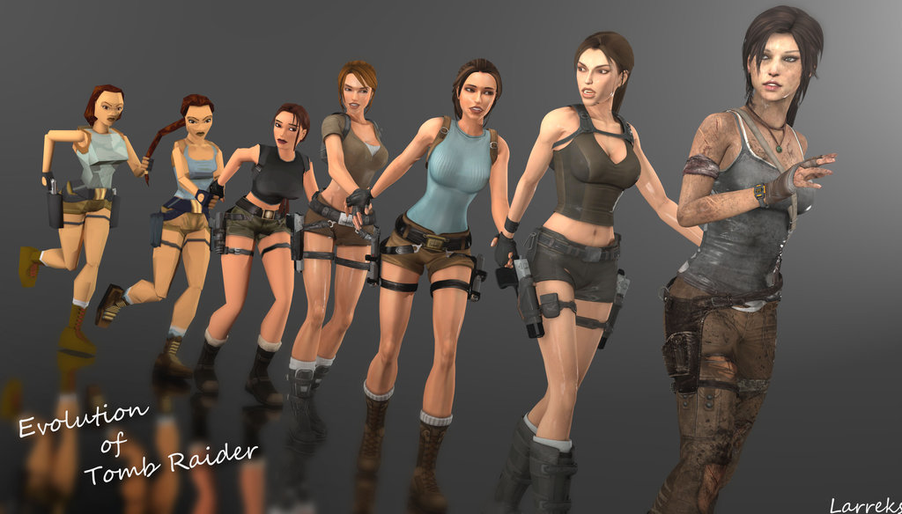
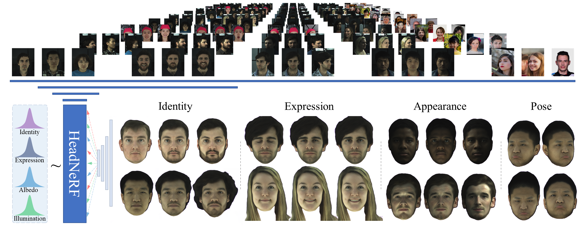
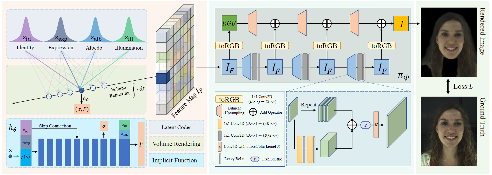
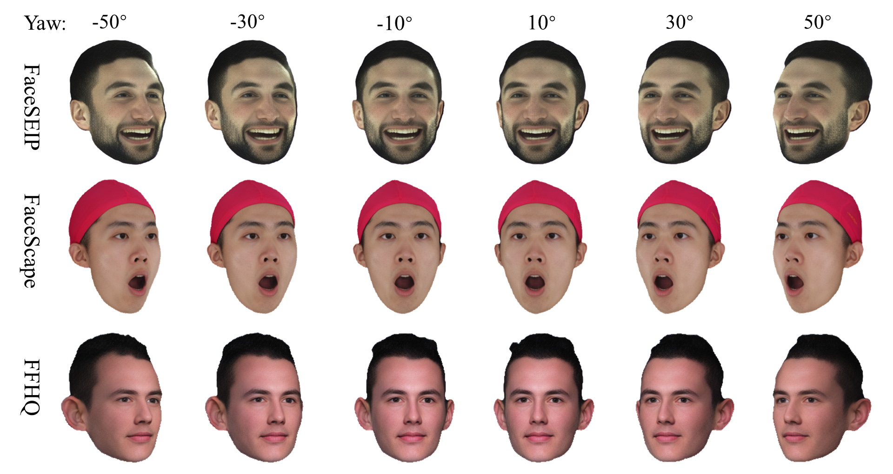
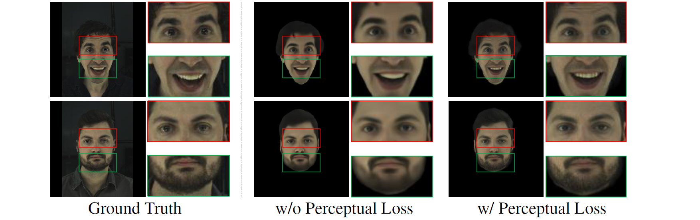
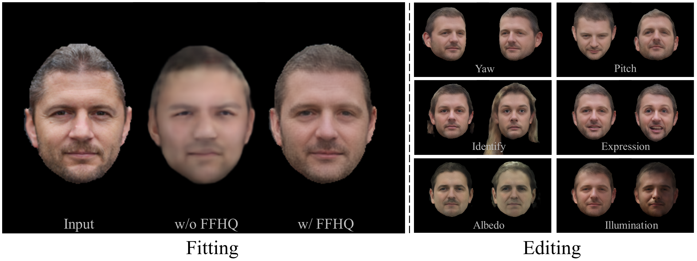
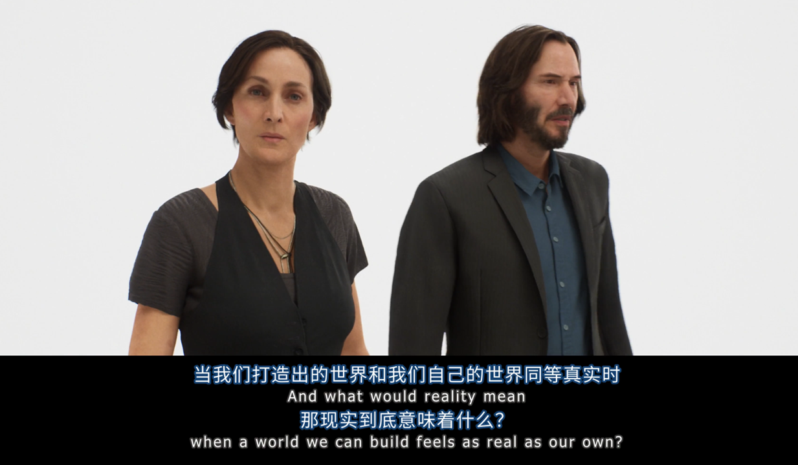

# 中科大提出高保真人头参数化模型HeadNeRF，可创建与编辑高保真数字人
2021年12月份，Epic公司发布了基于它们自家虚幻5打造的《黑客帝国: 觉醒》的演示[Demo](https://www.bilibili.com/video/BV1rY411p7Tg?spm_id_from=333.337.search-card.all.click)。demo中所展示的主演人物的毛孔毛发级高真实感建模，着实让人惊叹Epic的强大技术能力。

https://user-images.githubusercontent.com/49339865/166149034-942c38e1-f458-4fe1-a59d-2d3211c88ca1.mp4

据悉，以上演示Demo中的人物形象是由Epic名下的[MetaHuman Creator](https://www.unrealengine.com/zh-CN/metahuman-creator)创建生成，该应用可以让用户自由编辑调整目标数字形象的各种面部特征和皮肤细节，甚至于精确编辑调整发型、眼型、妆容等各个局部语义属性，且调整结果具有超逼真的显示渲染效果。

https://user-images.githubusercontent.com/49339865/166149045-ffae6443-2082-4910-97c7-f7a33c87daca.mp4

可以说，MetaHumane Creator在高保真数字人创建与渲染效果方面确立了一个新的标杆。

      
    <em>游戏古墓丽影历代劳拉形象</em>

略有瑕疵的是，尽管MetaHuman构建的虚拟数字人呈现了超逼真的成像渲染效果，但当我们怀着列文虎克的态度去刻意地观察其合成结果，却总是能发现那么几处隐隐难言语的不够真实的地方。不知大家看下图会不会有同样的感觉。

上述所谈到的不真实感可能是由MetaHuman的渲染假设导致的。具体的，随着图形相关研究技术的发展，该领域其实是在不断修正三维模型的光照渲染模型的，在该过程中也是提出多种三维光照类型，如朗伯光照模型，Phong光照模型以及BRDF光照模型等。然而，由于真实世界的复杂性，这些假设的渲染模型仍是不可避免的会与真实物理世界的渲染存在差异，从而导致相关渲染结果不够真实。

近期，一种新的渲染模型，即最近广为关注的神经辐射场体渲染模型(Neural Radiance Field，缩写NeRF)，有打破上述各种假设枷锁的趋势，以下为一些NeRF相关工作的渲染效果。可以发现NeRF具有照片级的渲染精度，渲染结果亦具有GAN等二维生成模型所不具备的多视角一致性，更是能对玻璃、火焰、液体等进行统一表示。

https://user-images.githubusercontent.com/49339865/166154164-0e4bebbb-5f57-4d93-ae3c-bdce6d9edb44.mp4

NeRF通过神经渲染与神经隐式表示以自适应地学习适合目标渲染对象的渲染方式，这使得NeRF相关的渲染假设少于上述传统的渲染方法的，从而使得NeRF的渲染逻辑与真实世界的渲染更加贴合。感兴趣的读者可以阅读[NeRF原文](https://arxiv.org/abs/2003.08934)来进一步了解相关细节。

https://user-images.githubusercontent.com/49339865/166154201-ee3bedfb-04e1-4581-9849-ef7604c98302.mp4

---

基于上述观察，中科大张举勇教授课题组提出了HeadNeRF，一种基于NeRF的高效全息人脸头部参数化模型，该工作发表于CVPR 2022，相关代码已开源。
- 文章链接: https://arxiv.org/abs/2112.05637
- 项目主页: https://crishy1995.github.io/HeadNeRF-Project/
- 代码链接: https://github.com/CrisHY1995/headnerf

      
    <em>HeadNeRF</em>

效果上，HeadNeRF可以实时地渲染高清图像级别的人脸头部，且支持直接编辑调整渲染结果的多种语义属性，如身份、表情以及颜色外观等。得益于NeRF结构的引入，HeadNeRF也支持直接编辑调整渲染对象的渲染视角，且不同视角的渲染结果具有优秀的渲染一致性。相关编辑效果如下视频所示。

https://user-images.githubusercontent.com/49339865/166429217-b007a29c-f8f7-4f1c-80cc-280d7772208b.mp4 

    <em>HeadNeRF: 高帧率版</em>

 

https://user-images.githubusercontent.com/49339865/166429658-ac5eb850-3bd9-4bde-bbb3-635af24d69d1.mp4

    <em>HeadNeRF: 高质量版</em>

<!--
https://user-images.githubusercontent.com/49339865/166154233-e0ead7e8-0915-45fd-8b2f-ef50d472dd93.mp4
-->

HeadNeRF的Motivation在于，NeRF本身可看作一种三维表示，尽管NeRF没有显式地重建目标场景的几何信息，但其本身通过预测场景的辐射场其实隐式地编码了目标场景的几何结构。进而使得，针对渲染任务，NeRF一定程度上可以等价甚至优于传统的纹理材质网格。且由于NeRF是完全基于神经网络的，因此NeRF的渲染过程是天然可微的，而其他传统的几何表示，如三维网格，点云，体素等则往往需要各种近似策略来缓解相关表示的渲染不可微问题，与之对应的参数化表示工作往往则需要收集并处理大量的三维扫描数据。相对的，HeadNeRF的构建过程只需要二维人脸图片。基于收集的三个大规模人脸头部图片数据集与精心设计的Loss函数与训练策略，所训练出来的HeadNeRF模型可以语义解耦地编辑渲染结果的各种语义属性。

      
    <em>HeadNeRF-Pipeline</em>

另一方面，HeadNeRF也将NeRF体渲染与2D神经渲染相结合，以加速NeRF渲染速度。具体地，代替直接渲染高分辨的人脸头部图片，先是基于NeRF的体渲染管线生成低分辨率、高通道数的特征图(Feature Map)，接着使用特殊设计的2D神经渲染网络层，逐步对上述特征图进行神经上采样，进而输出最终的预测结果。该2D神经渲染模块的引入大幅度提升了原始NeRF体渲染的渲染速度，将NeRF的渲染时间从单帧5s加速到了25ms，且同时很好地保持了NeRF隐式编码的几何结构。如下图所示，针对给定的语义参数组合，连续地编辑调整HeadNeRF的渲染视角、相机距离以及相机视野(FoV)，其相应地生成结果保持了优秀的渲染一致性，这进一步验证了HeadNeRF中2D神经渲染模块的有效性。

      
    <em>编辑渲染视角</em>

https://user-images.githubusercontent.com/49339865/166651727-ac14ae03-d1b4-4d8d-bb8d-62626c2dfeb6.mp4

    <em>编辑相机距离和FoV</em>

另一方面，2D神经渲染模块的引入也有效改善了NeRF的渲染效率，使得HeadNeRF可以在一般的显卡设备上单次前馈计算获得目标渲染图片的所有像素预测结果。这使得HeadNeRF可以针对预测结果应用全局的或者Instance级别的Loss 约束。在NeRF 的Photometric Loss的基础上，额外地使Perceptual Loss，如下图所示，Perceptual Loss的引入有效提升了HeadNeRF渲染结果的渲染细节。

      
    <em>关于Perceptual Loss的消融实验</em>

此外，该方法借助In-the-wild的单视角数据集([FFHQ](https://github.com/NVlabs/ffhq-dataset))来进一步增强HeadNeRF的表示能力和泛化能力。得益于所设计的训练策略，HeadNeRF可以同时使用来自不同渠道、不同类型的人脸数据来训练参数化模型。其中，多人多表情(多光照)多视角的人脸头部数据使得HeadNeRF学习人脸头部的几何形状先验、视角一致先验以及语义解耦先验。另一方面，In-the-wild的单视角数据则让HeadNeRF在训练过程中感知更多的身份、表情以及渲染风格类别，从而有效增强其表示、泛化能力。如下图所示，单视角数据集的引入有效提升了HeadNeRF的拟合能力，多人多表情多视角(多光照)数据集提供的相关先验则使HeadNeRF可以进一步解耦地编辑调整拟合结果的各个语义属性和渲染视角。

      
    <em>FFHQ单视角数据的引入有效增强了HeadNeRF的泛化拟合能力</em>

我们在以下视频中展示了HeadNeRF关于更多人脸头部图片的拟合结果，这些图片均来自In-the-wild的采集环境，且完全没有参与 HeadNeRF模型的训练构建。可以发现 HeadNeRF对于图中展示的多类型数据均可进行有效拟合。这一定程度也验证了HeadNeRF的表达能力和泛化能力。

https://user-images.githubusercontent.com/49339865/167671967-e43178f0-6860-4833-89a4-90014fb1ac66.mp4

得益于HeadNeRF高质量的渲染精度、优秀的解耦能力以及实时的渲染速度, 我们可以基于HeadNeRF设计多种相关应用。通过所训练所获得的HeadNeRF模型，可提取输入视频的HeadNeRF表情参数序列以及目标图像的HeadNeRF表示参数，并进一步的将目标图像的表情参数替换为视频的表情参数，从而实现将参考视频中的表情信息迁移至目标图像，从而实现了用视频中的表情来驱动目标图像。相关结果如下所示:

https://user-images.githubusercontent.com/49339865/166154301-fe360d5a-86b9-41e0-9659-6ca32e032cad.mp4

更多结果和介绍，请参考HeadNeRF的[项目主页](https://crishy1995.github.io/HeadNeRF-Project/)与[文章](https://arxiv.org/abs/2112.05637)。

我们相信，基于NeRF的数字人技术还将进一步演化，在不远的将来，关于《黑客帝国: 觉醒》演示中的灵魂发问将变成现实。

